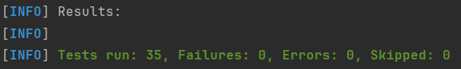

## Сборка и запуск
Для сборки и запуска вам понадобится JDK 17+.

Команда для сборки:
```bash
./mvnw clean package
```

Команда для запуска:
```bash
java -jar target/url-shortener.jar
```

## Архитектура
В этом проекте вместо CLI приложения я решил сделать REST API.  
Соответственно, основное взаимодействие с пользователем происходит по HTTP (кроме уведомлений, которые отправляются в консоль).  
Для управления и хранения данных используется СУБД H2. Данные приложения сохраняются в директории проекта в `./data/db.mv.db`.  

Структура БД:
1. users (id)
2. short_urls (id, short_url, long_url, creator_id, use_count, use_limit, created_at, ttl_hours, deleted)

Сущности:
1. User (таблица users). Представляет собой информацию о пользователе. У каждого пользователя есть уникальный id (uuid).   
   В рамках данного приложения другой информации не требовалось.
2. ShortURL (таблица short_urls). Представляет собой информацию о короткой ссылке.  
   Хранит id короткой ссылки, саму короткую ссылку (уникальные 6 символов), длинную ссылку, на которую будет перенаправление, счётчик переходов по ссылке,  
   лимит переходов, момент создания ссылки, время её жизни, а также поле с пометкой о "мягком удалении" (я решил, что так будет лучше, чем полностью удалять запись)

Основные классы:
1. ShortURLController - отвечает за приём HTTP-запросов и отправку HTTP-ответов. В нём активно используются DTO.
2. DTO - инкапсулируют данные из тел запросов/ответов. На уровне DTO также осуществляется первичная валидация данных из запросов.
3. UserService - фасад для операций с пользователями (получение, создание).
4. ShortURLService - фасад для операций с короткими ссылками (создание, редактирование, удаление, получение длинной на её основе).
5. ShortURLValidator - осуществляет вторичную валидацию, в нём данные из запросов анализируются в совокупности с данными из БД.
6. Сущности - были описаны ранее.
7. ShortURLMapper - для создания сущностей на основе DTO и наоборот, также для обновления сущностей на основе DTO.
8. UserRepository, ShortURLRepository - для работы с сущностями и отправки запросов в БД.
9. GlobalExceptionHandler - для перехвата исключений, выброшенных во время обработки запроса, и отправки ошибочных ответов.
10. CleanupService - каждый час осуществляет проверку коротких ссылок, осуществляет "мягкое удаление" просроченных и отправляет об этом уведомления в консоль.

Использованные технологии:
1. Spring Boot - для DI и IoC, а также для упрощения конфигурации приложения и сборки итогового jar
2. Spring Web MVC - для реализации взаимодействия по HTTP между пользователем и приложением
3. Spring Validation - для валидации тел приходящих запросов
4. Spring Data JPA - для реализации репозиториев, отправляющих запросы в СУБД
5. Spring Testing, JUnit, Mockito - для написания модульных и интеграционных тестов

## Примеры запросов
Для примера в приложении уже создан пользователь c id `f27cb826-35a9-4e6f-b9f0-399a71623d27` и короткая ссылка `wrPYCX`, ведущая на `https://github.com/asharykin`.

### Создание новой короткой ссылки (а также нового пользователя)
```bash
curl -X POST http://localhost:8080/shorten \
     -H "Content-Type: application/json" \
     -d "{ "longUrl": "https://github.com/asharykin/MEPhI_Java_URLShortener", "useLimit": 15, "ttlHours": 120 }"
```

### Создание новой короткой ссылки (для уже существующего пользователя)
```bash
curl -X POST http://localhost:8080/shorten \
     -H "Content-Type: application/json" \
     -H "UUID: f27cb826-35a9-4e6f-b9f0-399a71623d27" \
     -d "{ "longUrl": "https://github.com/asharykin", "useLimit": 15, "ttlHours": 120 }"
```

### Переход по короткой ссылке с перенаправлением (лучше это делать из браузера)
```bash
curl -X GET http://localhost:8080/wrPYCX
```

### Редактирование параметров уже существующей ссылки
```bash
curl -X PUT http://localhost:8080/wrPYCX \
     -H "Content-Type: application/json" \
     -H "UUID: f27cb826-35a9-4e6f-b9f0-399a71623d27" \
     -d "{ "useLimit": 25 }"
```

### Удаление уже существующей ссылки
```bash
curl -X DELETE http://localhost:8080/wrPYCX \
     -H "UUID: f27cb826-35a9-4e6f-b9f0-399a71623d27"
```

## Тестирование
  
Всего было написано 35 тестов, из которых 3 - интеграционные (ShortURLIntegrationTest), 32 - модульные.  

Более подробно:
1. ShortURLControllerTest - 7
2. ShortURLMapperTest - 5
3. ShortURLServiceTest - 6
4. UserServiceTest - 4
5. ShortURLValidatorTest - 10

Все тесты проходят успешно, в чём можно убедиться, использовав следующую команду:
```bash
./mvnw test
```
